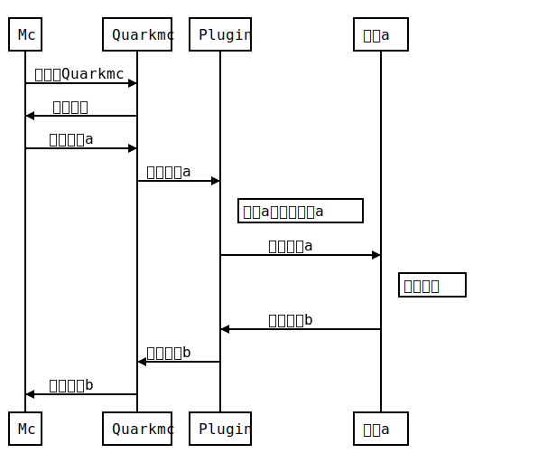
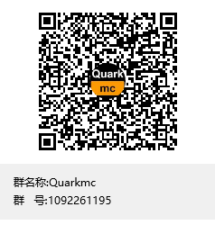

<div align="center">
  
</div>

# Quarkmc

[English](README_en.md)

Quarkmc 是一个供我的世界基岩版使用的一个 websocker 服务器，你可以使用他和他的插件来创建服务器。Quarkmc 的插件大幅增加了他的可扩展性。  
如果你是网易租赁服的服主，你可以使用开发者开发的插件，用几条命令就可以实现你想要的。  
如果你是开发者，使用一个个的命令方块必然使你心烦气躁。使用了 Quarkmc，一大串的命令方块可以被简化成几条代码。

## Quarkmc 执行的时序图



## 安装

```bash
git clone https://github.com/someone120/quark
$ npm install
```

## 使用

```bash
node main.js
```

## 插件

插件的位置会被储存在 database.db，若不是在必要的情况下请勿删改。

### 安装插件

#### Windows

1.将插件移动到项目文件夹  
2.按 Shift+右键，选择在此处打开 Power Shell  
3.执行 node plugin.js install 插件的名称

#### linux

```bash
cp 插件 quarkmc
node plugin.js install 插件的位置
```

### 编写插件

插件中有两个重要的的函数，分别是 `getAllComm` 和 `getForChat` 。getAllComm 是用于获取插件中支持的所有的命令，而 getForChat 会在命令被调用的时候调用。  
以下是每个插件必须包含的函数。  
请注意：在 nodejs 中，大多数操作都是异步操作。可能 `send` 中回调函数还没有执行完，下一步就已经开始了。

#### getAllComm

返回支持的命令。  
给定的变量：无  
返回的结果：["命令 1","命令 2","命令 3"，...]

#### getForComm

会在命令被调用的时候调用。  
给定的变量：调用时的文本,执行者的名称，conn 对象。

**以下是你在`sys/app.js`里可使用的函数。**

#### send

发送命令并返回结果。  
需要的变量：指令，conn 对象，回调函数。  
回调函数需要一个变量获取返回的结果。

#### fast_send

发送命令不返回结果。速度比 send 快。  
需要的变量：指令，conn 对象。

#### send_more

一次发送多条命令。  
需要的变量：conn 对象，指令 1，指令 2，指令 3...

#### say

在聊天栏发出一条信息。  
需要的变量：说的话，conn 对象。

#### setblock

放置一个方块。  
需要的变量：x，y，z，方块名称，特殊值（默认为 0），conn 对象

#### progressBar

显示进度条。  
需要的变量：当前执行的次数，总共执行的次数，执行者名称，conn 对象

# 需要帮助


